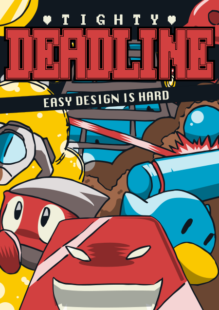

# Tighty Deadline

    

## Story

Earth, 2218.

Casual gaming addiction is a chronical pathology in society and game design reached an endless stale point. People are playing the same few games forever and money is just a matter of time for gaming megacorporations.

You are a KesieV Corp. employee and your mission is to become the richest game designer ever, serving the company by carefully crafting more of the same over and over again.

Be creative, have fun but... Follow company's **Tighty Deadline**.

## The game

Tighty Deadline is a puzzle/action game about level design. You've to design a map for a casual game using a match-3 level editor within a tight time limit. When the time is up you've to playtest your own stage and do your best. There are multiple casual games, inspired by mobile classics, which requires different design approaches that are progressively unlocked in a *roguelike* fashion.

    

It's browser based and can be played with both mouse and touchscreen, so it works on desktop computers and mobile devices. It supports offline too, so you can add it to your home screen/applications and use it like any other application. It has been tested on Chrome and Firefox on Android and multiple desktop OSs. It's still playable on iOS but it's muted, probably due to a bug of iOS 11.

Play the game [here](https://kesiev.com/deadline). Have a look to the in-game manual for more in-depth details.

## The sources

I've used [Gimp](https://www.gimp.org/) for the graphics and [Audacity](https://www.audacityteam.org/) for manipulating audio samples. The game has been written in vanilla JavaScript from scratch and I'm leaving its sources here as I usually do.
